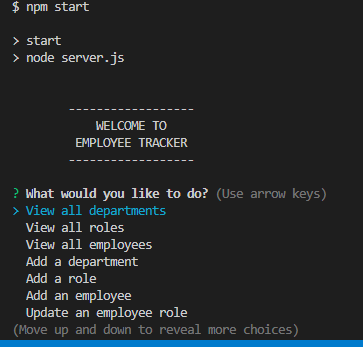
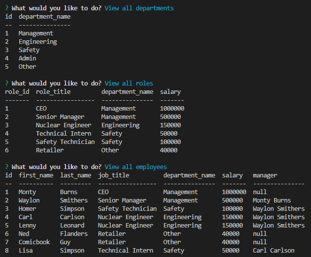
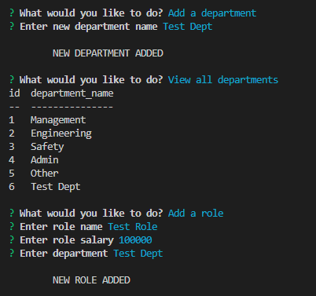

# Employee Tracker
Week 12 Challenge - Employee Database

## Description

This is an application that allows a user to keep track of their employees. It contains a database with 3 tables - departments, roles, and employees. The user can access the saved information in table form, and add new records to each of the tables. There is also the option to update an employee role, should they change roles. The application was built using JavaScript, Node.js, and MySQL.

## Table of Contents
* [Installation](#installation)
* [Usage](#usage)
* [Tests](#tests)
* [Questions](#questions)

---

## Installation

Enter user password for mySQL in: db/connections.js

To create database and tables, in mySQL prompt type:
"source db/db.sql"
"source db/schema.sql"

In prompt run:
"npm start" or "node server.js"

---

## Usage

On running the application the user is greeted with a welcome message and the main menu, where they can choose to either, view one of the 3 tables, add a new record to one of the tables, update an employee record, or exit. Once the user has chosen an option, and either viewed the requested table, or entered new data, then they will be returned to the main menu. This will continue until they choose to exit.

---

## Tests

Below are screenshots of the application at various stages.

User is presented with welcome message and main menu options

The database tables being displayed

Adding new data, with success message

Below is a link to a demonstration of the application:

[Video Demo on Google Drive](https://drive.google.com/file/d/1u08U4sslmkjN288EHVRm9w5MQClV1prN/view)

---

## Links

[GitHub](https://github.com/philmcgarty)

[Employee Tracker on GitHub](https://github.com/philmcgarty/employee-tracker)
